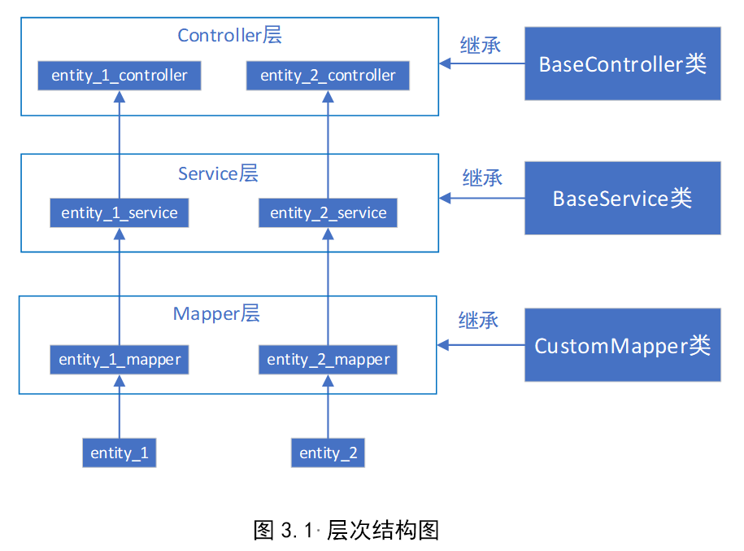
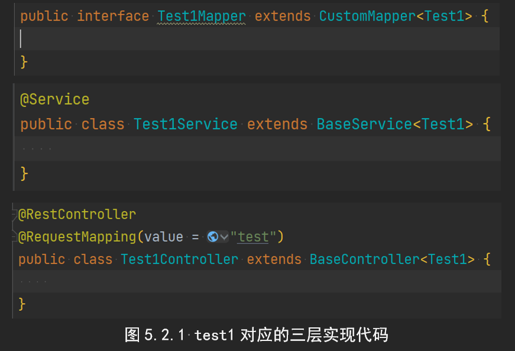
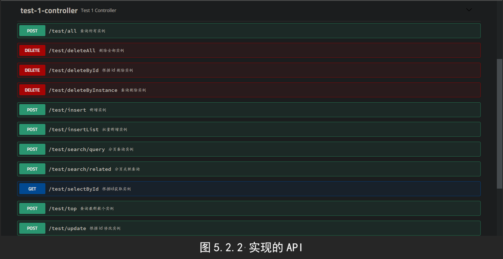

# 1. 项目简介

基于 **Springboot + tk.mybatis** 的关系型数据库访问的三层架构。对于任一实体类 demo，其 Mapper层、Service层、Controller层 分别继承底层的 CustomMapper、BaseService、BaseController，即可在该实体类对应的 Controller层 中实现相关的访问数据库的API。

> github地址：https://github.com/yr0418/sql_framework

# 2. 示例

启动项目后，浏览器输入：localhost:8888/swagger-ui.html

即可看到实现的API。

